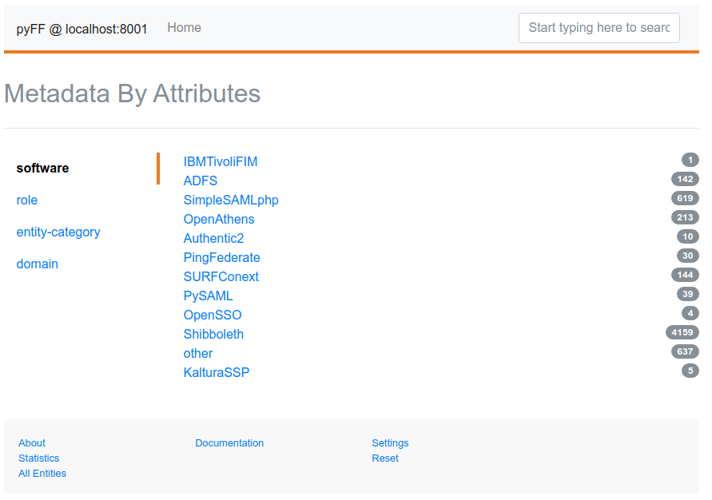

HOWTO Setup a MDX Server and configure it in Shibboleth IdP
-----------------------------------------------------------

1. [Introduction](#introduction)
2. [Installation of the necessary software](#installation-of-the-necessary-software)
3. [Configure pyFF](#configure-pyff)
4. [Run pyFF](#run-pyff)
5. [Configure Shibboleth IdP](#configure-shibboleth-idp)
6. [Alternative Configuration](#alternative-configuration)
7. [Test](#test)
8. [Authors](#authors)
9. [Credits](#credits)

Introduction
------------

A MDQ Server is a Metadata Query resource, as described in [Metadata Query Protocol](https://tools.ietf.org/html/draft-young-md-query-12).
Using this kind of resource we don't need to handle Federation Metadata for each IdP, SP or AA anymore, we can adopt a distribuited service, like a MDX server.
With a MDX server configured in a setup, out IdP would run metadata query on each SAML2 AuthnRequest to get the request entity Metadata.


Installation of the necessary software
--------------------------------------

````
apt install build-essential python3-dev libxml2-dev libxslt1-dev libyaml-dev python3-pip
pip3 install --upgrade pip
pip3 install virtualenv
````

Install [pyFF](https://pyff.io/)
````
virtualenv -p python3 python-pyff
source python-pyff/bin/activate
pip3 install git+https://github.com/IdentityPython/pyFF.git
````

Configure pyFF
--------------

````
# Create a folder for the configuration
mkdir pyff-configuration
cd pyff-configuration

# create folder for the certificates
mkdir certificates

# create certificates
openssl req -nodes -new -x509 -days 3650 -keyout certificates/private.key -out certificates/public.cert -subj '/CN=your.own.fqdn.com'

# create a pipeline directory
mkdir pipelines
````

Create a pipelines to fetch and handle all the Idem + eduGAIN metadata, this would be similar to this
````
# Metadata download and validation
- load xrd garr-loaded.xrd:
  - ./pipelines/garr.xrd
# select can even filter entity by IDPSSO or SPSSO Description and things ...
- select
- store:
     directory: ./garr
- publish:
     output: ./garr/garr-loaded.xml
- stats

# MDX server
- when request:
    - select
    - pipe:
        - when accept application/xml:
             - xslt:
                 stylesheet: tidy.xsl
             - first
             - finalize:
                cacheDuration: PT5H
                validUntil: P10D
             - sign:
                 key: certificates/private.key
                 cert: certificates/public.cert
             - emit application/xml
             - break
        - when accept application/json:
             - xslt:
                 stylesheet: discojson.xsl
             - emit application/json:
             - break
````

Now create the XRD file where to configure the URLs where the Metadata can be downloaded.
Name it `pipelines/garr.xrd`
````
<?xml version="1.0" encoding="UTF-8"?>
<XRDS xmlns="http://docs.oasis-open.org/ns/xri/xrd-1.0">
  <XRD>
    <Link rel="urn:oasis:names:tc:SAML:2.0:metadata" href="http://md.idem.garr.it/metadata/idem-test-metadata-sha256.xml"/>
  </XRD>
  <XRD>
    <Subject>http://md.idem.garr.it/metadata/edugain2idem-metadata-sha256.xml</Subject>
    <Link rel="urn:oasis:names:tc:SAML:2.0:metadata" href="http://md.idem.garr.it/metadata/edugain2idem-metadata-sha256.xml">
        <Title>IDEM+eduGAIN</Title>
        <ds:KeyInfo xmlns:ds="http://www.w3.org/2000/09/xmldsig#">
            <ds:X509Data>
                <ds:X509Certificate>
                MIIDWzCCAkOgAwIBAgIJALo/EGIq8rgNMA0GCSqGSIb3DQEBCwUAMEQxCzAJBgNV
                BAYTAklUMRYwFAYDVQQKDA1JREVNIEdBUlIgQUFJMR0wGwYDVQQDDBRJREVNIE1l
                dGFkYXRhIFNpZ25lcjAeFw0xOTAxMjIxNjA5MjBaFw0yMjAxMjExNjA5MjBaMEQx
                CzAJBgNVBAYTAklUMRYwFAYDVQQKDA1JREVNIEdBUlIgQUFJMR0wGwYDVQQDDBRJ
                REVNIE1ldGFkYXRhIFNpZ25lcjCCASIwDQYJKoZIhvcNAQEBBQADggEPADCCAQoC
                ggEBAMay3N21fswu3AE6hqCPUVjvCyol5OKTHs9CXDIFyAoigP+YSdloLSGwx6n6
                ks9aBbJqlzRBIEd3CpByvX7GmBuITl3ElhxMY40Cv/ULok1GbDmQMhPScU6J1f9b
                526R9Ks+BbYZYmBRX9gqmpX1R867IES4z+JhXnXr5K8HTPjfaDGh2xORL6msXjww
                DJgaJCOpBCctLvCWcmUp0ucpl8VHGjFAAI5Eb6pwQEEPj1yqW52ggM+AHNFY6bAC
                9RX7Qv8MonQZwXpNNBNL+UcnGLVBXtBftd4zq7XxPNN9F/Ele3YJGaOVk8cCEJt5
                SfTeguzUaAyh8f/BfEs6CwucCSsCAwEAAaNQME4wHQYDVR0OBBYEFCZQVW7g6mc9
                3zaJP/p0lGbVQ4O6MB8GA1UdIwQYMBaAFCZQVW7g6mc93zaJP/p0lGbVQ4O6MAwG
                A1UdEwQFMAMBAf8wDQYJKoZIhvcNAQELBQADggEBAF6OKKdWyeI385ZS5i29mSMA
                4BoPCVAhyXDMLMdqTQqvZp3PAL/zjLYRYKgGH53d4uN/EztWM8YBdyzBzdbpFWpd
                wRGzwyfXzt6l2luElWb59PacNqHbBkyFO2YZmgqLzgrVX1gA3/3ij9zrLqd1lHVH
                MHPUpqv98KYXnttyzhacdYaRGDO/2A28U9QeRq2/HgVScklhJvoySeNyXNspYfte
                ePRxeHBj21DgiQb+X1+ovKASM+RULa6cA1TJBCop+VqZMZiRJ3Rj6RML63ckEO8H
                Md/XFvxlr+P2JcVKzHaZEEUGGINUCCuDABqKBZOqykGWXDastVw6/I0OIdLmWNI=
                </ds:X509Certificate>
            </ds:X509Data>
      </ds:KeyInfo>
    </Link>
  </XRD>
</XRDS>
````

Test the pipelines
````
pyff pipelines/garr.fd
````

You should have aan output of this kind
````
total size:     6003
selected:       6003
          idps: 3257
           sps: 2744
````

Run pyFF
--------

Please see `pyffd --help` to customize options and argument to execute, the following is a debug example.
Remember to enable caching in a production environment with RedisWhooshStore for better performances.
````
pyffd -p pyff.pid -f -a --loglevel=DEBUG --dir=`pwd` -H 0.0.0.0 -P 8001 --frequency=180 --no-caching pipelines/garr.fd
````

A Production example with RedisWhoosh
````
PYFF_STORE_CLASS=pyff.store:RedisWhooshStore pyffd -p pyff.pid -f -a --dir=`pwd` -H 0.0.0.0 -P 8001  pipelines/garr.fd
````

Using gunicorn
````
gunicorn --reload --reload-extra-file pipelines/garr.fd --preload --bind 0.0.0.0:8001 -t 600 -e PYFF_PIPELINE=pipelines/garr.fd -e PYFF_STORE_CLASS=pyff.store:RedisWhooshStore -e PYFF_UPDATE_FREQUENCY=600 -e PYFF_PORT=8001 --threads 4 --worker-tmp-dir=/dev/shm --worker-class=gthread pyff.wsgi:app
````

Configure Shibboleth IdP
------------------------

1. Get the MDQ certificate and store it in `/opt/shibboleth-idp/credentials/mdq-cert.pem`
2. Add in `/opt/shibboleth-idp/conf/services.xml`, in the MetadataProviders resources, called `<util:list id="shibboleth.MetadataResolverResources">` the child element `<value>%{idp.home}/conf/metadata-providers-mdq.xml</value>`
3. Create `/opt/shibboleth-idp/conf/metadata-providers-mdq.xml` following this example, remember to change the MDQ server url to your working one

````
<?xml version="1.0" encoding="UTF-8"?>
<!-- This file is an EXAMPLE metadata configuration file. -->
<MetadataProvider id="ShibbolethMetadataMdq" xsi:type="ChainingMetadataProvider"
    xmlns="urn:mace:shibboleth:2.0:metadata"
    xmlns:resource="urn:mace:shibboleth:2.0:resource"
    xmlns:security="urn:mace:shibboleth:2.0:security"
    xmlns:md="urn:oasis:names:tc:SAML:2.0:metadata"
    xmlns:xsi="http://www.w3.org/2001/XMLSchema-instance"
    xsi:schemaLocation="urn:mace:shibboleth:2.0:metadata http://shibboleth.net/schema/idp/shibboleth-metadata.xsd
                        urn:mace:shibboleth:2.0:resource http://shibboleth.net/schema/idp/shibboleth-resource.xsd
                        urn:mace:shibboleth:2.0:security http://shibboleth.net/schema/idp/shibboleth-security.xsd
                        urn:oasis:names:tc:SAML:2.0:metadata http://docs.oasis-open.org/security/saml/v2.0/saml-schema-metadata-2.0.xsd">

    <MetadataProvider id="DynamicEntityMetadata" xsi:type="DynamicHTTPMetadataProvider"
                  connectionRequestTimeout="PT10S"
                  connectionTimeout="PT10S"
                  socketTimeout="PT10S">

    <MetadataFilter xsi:type="SignatureValidation" requireSignedRoot="true"
        certificateFile="%{idp.home}/credentials/mdq-cert.pem"/>

    <MetadataFilter xsi:type="RequiredValidUntil" maxValidityInterval="P14D"/>
    <MetadataQueryProtocol>http://MDQ.SERVER.URL:8001/</MetadataQueryProtocol>

    </MetadataProvider>

</MetadataProvider>
````

Now Reload or restart Shibboleth IdP

````
export JAVA_HOME=/usr/lib/jvm/java-1.8.0-amazon-corretto/jre
/opt/shibboleth-idp/bin/reload-service.sh -id shibboleth.AttributeFilterService -u http://localhost:8080/idp

# or

touch /opt/jetty/webapps/idp.xml
````

Alternative Configuration
-------------------------

Let's suppose that we need a simple as possibile SAML2 MDQ server that:

1) Runs locally as a private service for multiple containers or VM
2) Should be decoupled from pyFF
3) Should be much more performat than pyFF

See [Django MDQ](https://github.com/UniversitaDellaCalabria/Django-MDQ)


Test
----

Use a federation entity SP to test the MDQ presence
````
/opt/shibboleth-idp/bin/mdquery.sh -e https://coco.release-check.edugain.org/shibboleth -u http://localhost:8080/idp

# or with an attr policy
/opt/shibboleth-idp/bin/aacli.sh -n luigi -r https://coco.release-check.edugain.org/shibboleth  -u http://localhost:8080/idp
````

You should see in pyffd logs something like
````
---
total size:     6003
selected:       1
          idps: 0
           sps: 1
---
10.0.3.101 - - [07/Feb/2020:12:41:38] "GET /entities/https:%2F%2Fcoco.release-check.edugain.org%2Fshibboleth HTTP/1.1" 200 8928 "" "ShibbolethIdp/3.4.6 OpenSAML/3.4.5"
INFO:cherrypy.access.140406102627160:10.0.3.101 - - [07/Feb/2020:12:41:38] "GET /entities/https:%2F%2Fcoco.release-check.edugain.org%2Fshibboleth HTTP/1.1" 200 8928 "" "ShibbolethIdp/3.4.6 OpenSAML/3.4.5"
````


**Frontend**: PyFF Entities catalog

Authors
-------
Giuseppe De Marco <giuseppe.demarco@unical.it>

Credits
-------
[IdentityPython](https://idpy.org/)
