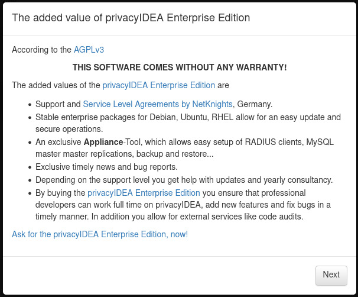
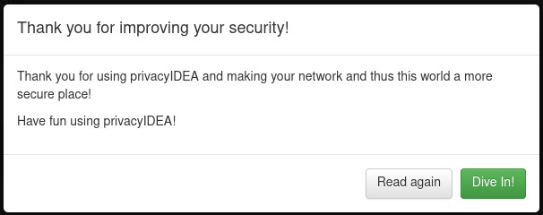

HOWTO Install and Configure a PrivacyIDEA server
================================================

.. image:: https://wiki.idem.garr.it/IDEM_Approved.png
   :width: 120 px
  
Index
-----
#. `Overview`_
#. `Requirements`_
#. `Setup dependencies`_

   #. `System`_
   #. `SQL Database`_
   #. `Web Server`_

#. `Install PrivacyIDEA`_
#. `Create Administrators`_
#. `Login to the Web UI`_
#. `Setup basic Policies`_

   #. `Disable Welcome message`_
   #. `Change the Logout Time`_
   #. `Allow admin user to do everything`_
   #. `Change the Token label`_

#. `Create UserIdResolvers`_

   #. `Create an LDAP resolver`_

#. `Create Realms`_

   #. `Create the 'default' Realm`_

#. `Enroll Tokens`_

   #. `Enroll a TOTP token from the WebUI`_
   #. `Enroll an Email Token from the WebUI`_

#. `Reference`_
#. `Authors`_
#. `License`_

Overview
--------

* `PrivacyIDEA overview <https://privacyidea.readthedocs.io/en/latest/overview/index.html>`_

Requirements
------------

* Python 3.9.2, Python Virtual Environment & PIP (package installer di Python)
* SQL database
* Apache web server with WSGI support for Python3
* Debian 11

`[TOP] <Index_>`_

Setup dependencies
------------------

System
++++++

Create a system user ``privacyidea`` without SSH access:

* ``sudo adduser --system --group --shell /bin/bash --home /opt/privacyidea privacyidea``

`[TOP] <Index_>`_

SQL Database
++++++++++++

#. Become ROOT:

   * ``sudo su -``

#. Install the required packages:

   * ``apt install default-mysql-server``

#. Improve MySQL Installation Security:

   * ``mysql_secure_installation``

     * Root password: *empty or a desired value for the root password of MariaDB*
     * Switch to unix_socket: *Y*
     * Change the root password? *N*
     * Remove anonymous users? *Y*
     * Disallow root login remotely? *Y*
     * Remove test database and access to it? *Y*
     * Reload privilege tables now? *Y*

#. Create the PrivacyIDEA database:

   * ``sudo mariadb``
   * ``CREATE DATABASE pi;``
   * ``CREATE USER "pi"@"localhost" IDENTIFIED BY "<PASSWORD>";``
   * ``GRANT ALL PRIVILEGES ON pi.* TO "pi"@"localhost";``
   * ``quit``

`[TOP] <Index_>`_

Web Server
++++++++++

#. Install the required packages:

   * ``sudo apt install apache2 libapache2-mod-wsgi-py3``

#. Enable the required modules:

   * ``sudo a2enmod ssl rewrite wsgi``

#. Remove the default HTTP site from Apache:

   * ``sudo a2dissite 000-default``

#. Restart Apache:

   * ``sudo systemctl restart apache2.service``

`[TOP] <Index_>`_

Install PrivacyIDEA
-------------------

#. Become ROOT:

   * ``sudo su -``

#. Install the packages required:

   * ``apt install python3-pip python3-venv``

#. Create PrivacyIDEA configuration dir:

   * ``mkdir /etc/privacyidea``
   * ``chown privacyidea:privacyidea /etc/privacyidea``

#. Become the PrivacyIDEA user:

   * ``sudo su privacyidea``

#. Create the PrivacyIDEA Virtual Environment:

   * ``python3 -m venv /opt/privacyidea``

#. Install PrivacyIDEA into the new Virtual Environment:

   * ``cd /opt/privacyidea``
   * ``source bin/activate``
   * ``pip install --upgrade pip``
   * ``pip install --upgrade setuptools wheel pymysql pymysql-sa``
   * ``pip install -r https://raw.githubusercontent.com/privacyidea/privacyidea/v3.8.1/requirements.txt``
   * ``pip install privacyidea==3.8.1``

#. Connect the database to PrivacyIDEA:

   * ``SQLALCHEMY_DATABASE_URI="pymysql://pi:<PASSWORD>@localhost:3306/pi"``
   * ``echo "SQLALCHEMY_DATABASE_URI = '$SQLALCHEMY_DATABASE_URI'" >> /etc/privacyidea/pi.cfg``

#. Create PrivacyIDEA tables:

   * ``pi-manage create_tables``

#. Stamping the database to the current database schema version for the update process later:

   * ``pi-manage db stamp head -d /opt/privacyidea/lib/privacyidea/migrations/``

#. Improve PrivacyIDEA Installation Security:

   * ``echo "PI_PEPPER = '$(tr -dc A-Za-z0-9_ </dev/urandom | head -c24)'" >> /etc/privacyidea/pi.cfg``
   * ``echo "SECRET_KEY = '$(tr -dc A-Za-z0-9_ </dev/urandom | head -c24)'" >> /etc/privacyidea/pi.cfg``

#. Create an encryption key for PrivacyIDEA secrets:

   * ``pi-manage create_enckey``
   * ``PI_ENCFILE="/opt/privacyidea/lib/python3.9/site-packages/enckey"``
   * ``echo "PI_ENCFILE = '$PI_ENCFILE'" >> /etc/privacyidea/pi.cfg``

#. Create a key for verification of audit log entries:

   * ``pi-manage create_audit_keys``
   * ``PI_AUDIT_KEY_PRIVATE="/opt/privacyidea/lib/python3.9/site-packages/private.pem"``
   * ``PI_AUDIT_KEY_PUBLIC="/opt/privacyidea/lib/python3.9/site-packages/public.pem"``
   * ``echo "PI_AUDIT_KEY_PRIVATE = '$PI_AUDIT_KEY_PRIVATE'" >> /etc/privacyidea/pi.cfg``
   * ``echo "PI_AUDIT_KEY_PUBLIC = '$PI_AUDIT_KEY_PUBLIC'" >> /etc/privacyidea/pi.cfg``

#. Configure some settings of PrivacyIDEA:

   * Truncate Audit entries to fit into DB columns: 

     * ``echo "PI_AUDIT_SQL_TRUNCATE = True" >> /etc/privacyidea/pi.cfg``

   * Define the PrivacyIDEA page ``<title>``'s value:

     * ``echo 'PI_PAGE_TITLE = "privacyIDEA Authentication System"' >> /etc/privacyidea/pi.cfg``

   * Logging:

     * ``echo "PI_LOGFILE = '/opt/privacyidea/privacyidea.log'" >> /etc/privacyidea/pi.cfg``
     * ``echo "PI_LOGLEVEL = 20" >> /etc/privacyidea/pi.cfg``

   * Administrators Realms:

     * ``echo "SUPERUSER_REALM = ['administrators']" >> /etc/privacyidea/pi.cfg``

#. Exit from the Python Virtual Environment:

   * ``deactivate``

#. Become ROOT:

   * ``exit`` (this has to be executed if the command line starts with ``privacyidea@...``
   * ``sudo su -``

#. Enable the required Apache2 configuration:

   * ``PRIVACYIDEA_VENV_APACHECONF="https://raw.githubusercontent.com/NetKnights-GmbH/ubuntu/master/deploy/apache/sites-available/privacyidea-venv.conf"``
   * ``PRIVACYIDEA_APACHECONF="https://raw.githubusercontent.com/NetKnights-GmbH/ubuntu/master/deploy/apache/sites-available/privacyidea.conf"``
   * ``sudo wget "$PRIVACYIDEA_VENV_APACHECONF" -O /etc/apache2/conf-available/privacyidea-venv.conf``
   * ``sudo wget "$PRIVACYIDEA_APACHECONF" -O /etc/apache2/sites-available/privacyidea.conf``

#. Adapt the downloaded file to your needs:

   * ``sudo vim /etc/apache2/sites-available/privacyidea.conf``

     .. code-block:: apache

        ServerName <PRIVACYIDEA_FQDN>
        ...
        WSGIScriptAlias /      /opt/privacyidea/etc/privacyidea/privacyideaapp.wsgi
        ...
        SSLCertificateFile    /etc/ssl/certs/ssl-cert.crt
        SSLCertificateKeyFile /etc/ssl/private/ssl-cert.key
        SSLCACertificateFile  /etc/ssl/certs/ca-certificates.crt

#. Enable the Apache2 configurations:

   * ``sudo a2enconf privacyidea-venv``
   * ``sudo a2ensite privacyidea``

#. Restart Apache2 web server:

   * ``sudo systemctl restart apache2.service``

`[TOP] <Index_>`_

Create Administrators
---------------------

The creation of the administrators' users in the PrivacyIDEA database
is done throught a command line in the PrivacyIDEA Virtual Environment:

* ``cd /opt/privacyidea``
* ``source bin/activate``
* ``pi-manage admin add admin``

As long as no admin policy is defined all administrators are allowed to do everything.
Take a look to `Admin policies <https://privacyidea.readthedocs.io/en/v3.8.1/policies/admin.html#admin-policies>`_

If you lock out you can disable the wrong policies by the command line with:

* ``cd /opt/privacyidea``
* ``source bin/activate``
* ``pi-manage policy -h``

`[TOP] <Index_>`_

Login to the Web UI
-------------------

Open ``https://<PRIVACYIDEA_FQDN>/`` and enter the Admin username ``admin`` and ``<PASSWORD>``.

Administrators will be able to configure the system and to manage all tokens,
while normal users will only be able to manage their own tokens.

`[TOP] <Index_>`_

Setup basic Policies
--------------------

DOC: `Policies <https://privacyidea.readthedocs.io/en/v3.8.1/policies/index.html?highlight=policies>`_

Policies are just a set of definitions. 
These definitions are meant to modify the way privacyIDEA reacts on requests.
Different policies have different scopes where they act.

For example:

* **admin** policies define, what an administrator is allowed to do.
* **user** policies define, how the system reacts if a user is managing his own tokens.
* **authentication** and **authorization** policies influence the authentication and the authorization of users/admins.

Disable Welcome message
+++++++++++++++++++++++

When the administrator logs in and no UserIdResolver and no Realm are defined,
a popup appears, which asks you to create a default Realm.
Say "**No**" to the *Create default realm* request.

Than disable the Welcome message with the Policy template ``hide_welcome``:

* Go to Config -> Policies
* Create new Policy -> Show Policy templates
* Click on **hide_welcome**
* Set to 2 the **Priority** value
* Set the Policy Name to **hide_welcome**
* Save Policy

`[TOP] <Index_>`_

Change the Logout Time
++++++++++++++++++++++

Set the timeout, after which a user in the WebUI will be logged out.
The default timeout is 120 seconds.

* Go to Config -> Policies
* Create new Policy
* Set to **webui** the Scope
* Move on the **Action** tab
* Insert ``logout_time`` in the *filter action* search box
* Set its value to 10 minutes: 600
* Set to 3 the **Priority** value
* Set the Policy Name to **webui-timeout**
* Save Policy

`[TOP] <Index_>`_

Allow admin user to do everything
+++++++++++++++++++++++++++++++++

**Attention:** Admins in privacyIDEA have rights to all actions at the beginning.
This will apply as long as no admin policy is defined. 
If you define a policy in the scope ``admin``, 
only the rights entered for the policies apply to all admins. 
If there is no further admin policy yet, 
you should be careful not to block yourself out of the web UI.

* Go to Config -> Policies
* Create new Policy -> Show Policy templates
* Click on **superuser**
* Set the Policy Name to **superuser**
* Set to 1 the **Priority** value
* Leave the value of **Admin-Realm** under the **Condition** tab to **None Selected** to enable policy for all admins' realms.
* Add the username of the administrator created ``admin`` to field **Admin** to enable the policy for only the selected user.
* Save Policy

`[TOP] <Index_>`_

Change the Token label
++++++++++++++++++++++

Set label for a new enrolled Google Authenticator app.
Possible tags are <u> (user), <r> (realm), <s> (serial).

* Go to Config -> Policies
* Create new Policy -> Show Policy templates
* Click on **enroll_tokenlabel**
* Set the Policy Name to **enroll_tokenlabel**
* Set to 4 the **Priority** value
* Move on the **Action** tab and click on the **Show selected actions only** button
* Edit the **tokenlabel** by inserting the label you prefer (e.g.: Lab MFA 42: OTP (<u>))
* Save Policy

`[TOP] <Index_>`_

Create UserIdResolvers
----------------------

DOC: `UserIdResolvers <https://privacyidea.readthedocs.io/en/v3.8.1/configuration/useridresolvers.html#useridresolvers>`_

The UserIdResolver is the connector to a user source.
You can create as many UserIdResolvers as you wish and edit existing resolvers.

There are resolvers for simple text file, LDAP Directory, SQL database, SCIM, HTTP.
It also possible to develop your own resolver with a python module.

`[TOP] <Index_>`_

Create an LDAP resolver
+++++++++++++++++++++++

DOC: `PrivacyIDEA LDAP Resolver <https://privacyidea.readthedocs.io/en/v3.8.1/configuration/useridresolvers.html#ldap-resolver>`_

The LDAP resolver can be used to access any kind of LDAP service
like OpenLDAP, Active Directory, FreeIPA, Penrose, Novell eDirectory.

PrivacyIDEA can use the following datas:

* username
* surname
* givenname
* email
* phone
* mobile

* Go to Config -> Users to create a UserIdResolver.
* Choose **New ldapresolver** and fill at least the following fields:

  * Resolver name: ``LABMFA<N>-ldap-resolver``
  * Server URI: ``ldap://idem-day-idp-<N>.aai-test.garr.it``
  * STARTTLS: ``Checked``
  * TLS Version: ``TLS v1.3``
  * Verify TLS: ``Checked`` and ``/etc/ssl/certs/ca-certificates.crt``
  * Base DN: ``ou=people,dc=idem-day-org-<N>,dc=it``
  * Scope: ``SUBTREE``
  * Bind Type: ``Simple``
  * Bind DN: ``cn=idm-user,ou=system,dc=idem-day-org-<N>,dc=it``
  * Bind Password: ``<IDM-USER-PASSWORD>``
  * Per-process server pool: ``Checked``
  * Press on ``Preset OpenLDAP``
  * Insert into ``Loginname Attribute`` the LDAP attribute name used to login the PrivacyIDEA Web UI
  * Insert into ``Search Filter`` the correct value to list all possible users
  * Remove from the ``Attribute mapping`` those datas not managed by the OpenLDAP server connected
  * Insert into ``Multivalue Attributes`` a Python list of user attributes, that should return a list of values. E.g.: ``['mail']``
  * Insert into ``UID Type`` the unique identifier for the LDAP object. We suggest to use an attribute with a value that not change permanently. If your OpenLDAP get corrupted, you will break all due the change of the ``entryUUID`` value for all entries.
  * Check the ``No retrieval of schema information`` box to disable the retrieval of schema information in order to improve performance.

The Server URI can contains a comma separated list of servers. 
The servers are used to create a server pool and are used with a round robin strategy.

* Test with:

  * Quick resolver test
  * Test LDAP Resolver

* Save resolver

`[TOP] <Index_>`_

Create Realms
-------------

DOC: `PrivacyIDEA Realms <https://privacyidea.readthedocs.io/en/v3.8.1/configuration/realms.html#realms>`_

Realms are collections of resolvers that can be managed by administrators and where policies can be applied.

Users need to be in realms to have tokens assigned.

A user, who is not member of a realm can not have a token assigned and can not authenticate.

Several different UserIdResolvers can be combined into a realm.

Create the 'default' realm
++++++++++++++++++++++++++

The system knows one default realm > ``defrealm``. 

The ``defrealm`` is a special endpoint to define the default realm. The default realm is used if no user realm is specified.

Users within the default realm can authenticate with their username.

Users outside of the default realm have to authenticate theirselves with ``username@realm-name``.

Into this HOWTO we'll use only the default realm because we don't need more than one realm.

* Go to Config -> Realms
* Check the new resolver created
* Set ``idem-day-org-<N>.it`` on Realm name
* Press on "Create realm"

If other realms are defined on PrivacyIDEA, the default one can set on the realm list from the WebUI.

`[TOP] <Index_>`_

Enroll Tokens
-------------

DOC: `PrivacyIDEA Tokens <https://privacyidea.readthedocs.io/en/v3.8.1/tokens/index.html?highlight=tokens>`_

Without any specific policy an user can use any token supported by PrivacyIDEA.

Enroll a TOTP token from the WebUI
++++++++++++++++++++++++++++++++++

DOC: `TOTP Token <https://privacyidea.readthedocs.io/en/v3.8.1/tokens/tokentypes/totp.html#totp-token>`_

A time based One Time Password tokens based on `RFC6238 <https://tools.ietf.org/html/rfc6238>`_.

* Go to Tokens -> Enroll Token
* Select *TOTP: Time Base One Time Passwords.*
* Enter the user name under *Username*
* Leave the *PIN* empty
* Press the Enroll Token button
* Scan the QR Code with Google Authenticator or another apps
* TOTP Token is enrolled
* Enjoy

`[TOP] <Index_>`_

Enroll an Email Token from the WebUI
++++++++++++++++++++++++++++++++++++

DOC: `Email Token <https://privacyidea.readthedocs.io/en/v3.8.1/tokens/tokentypes/email.html#email-token>`_

A token that sends the OTP value to the E-Mail address of the user.

#. Add your SMTP server:

   #. Go to Config -> System -> SMTP servers
   #. Adding a new SMTP server by opening ``New SMTP server``:

      * Identifier: ``labmfa<N>-smtp``
      * IP or FQDN: ``idem-day-idp-<N>.aai-test.garr.it``
      * Port: ``1025``
      * Sender Email: ``privacyidea@idem-day-org-<N>.it``
      * StartTLS: ``no``
      * Recipient for testing: ``personal@email.it``
      * Test with ``Send Test Email``
      * Save SMTP server

#. Link the SMTP server to the Email Token:

   * Go to Config -> Tokens -> Email
   * Insert the SMTP server created under *SMTP server configuration*

#. Enroll an Email Token from the WebUI:

   * Go to Tokens -> Enroll Token
   * Select *Email: Send a One Time Passwords to the users email address.*
   * Check the box *Read email address dynamically from user source on each request.*
   * Enter the user name under *Username*
   * Leave the "PIN" empty
   * Press the Enroll Token button
   * Email Token is enrolled
   * Enjoy

   The Email Token is a challenge response token,
   this means that first the user sends an authentication request to obtain the OTP value sent by email,
   and then sends a second authentication request by presenting the OTP value obtained by email:

   #. ``curl -X POST -F 'user=<USERNAME>' -F 'pass=' https://idem-day-mfa-<N>.aai-test.garr.it/validate/check``
   #. ``curl -X POST -F 'user=<USERNAME>' -F 'transaction_id=<TRANSACTION_ID>' -F 'pass=<EMAIL-OTP>' https://idem-day-mfa-<N>.aai-test.garr.it/validate/check``

`[TOP] <Index_>`_

Reference
---------

* `PrivacyIDEA Documentation <https://privacyidea.readthedocs.io/en/v3.8.1/index.html>`_

Authors
-------

* `Marco Malavolti <mailto:marco.malavolti@garr.it>`_

License
-------

This HOWTO is licensed under `CC BY-SA 4.0 <https://creativecommons.org/licenses/by-sa/4.0/>`_.

`[TOP]`_
